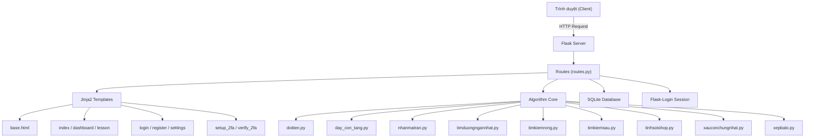
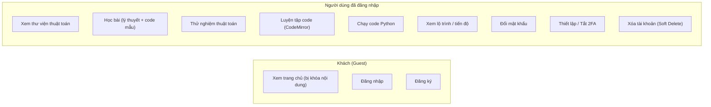
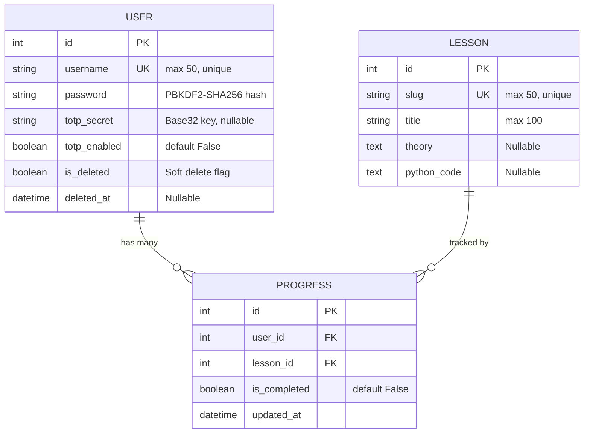
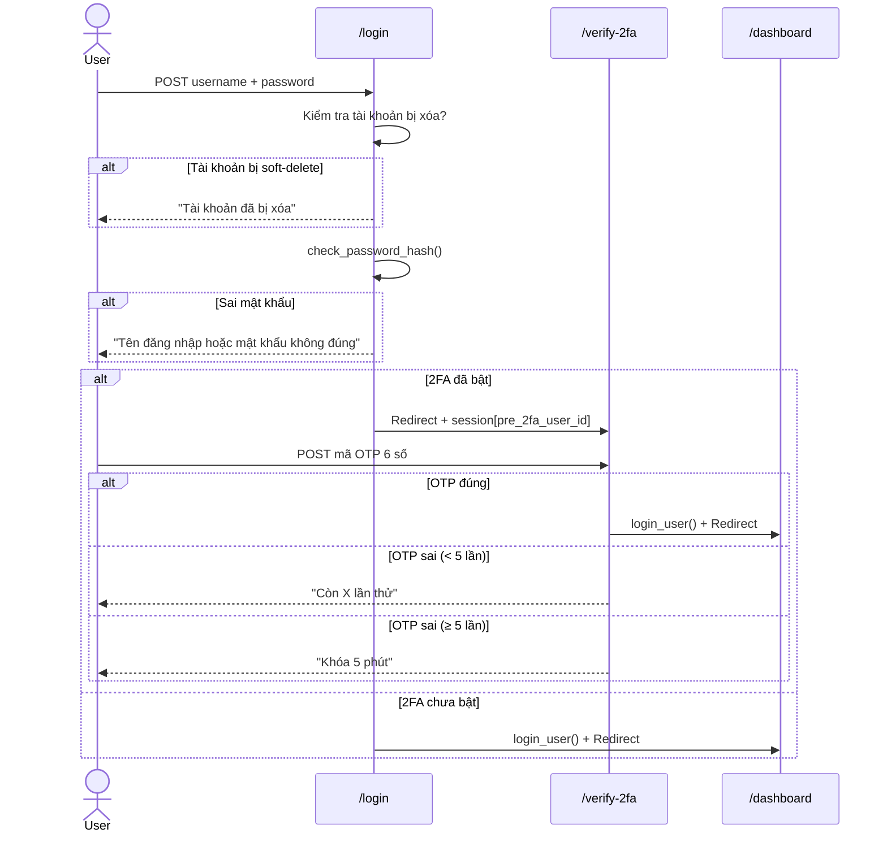
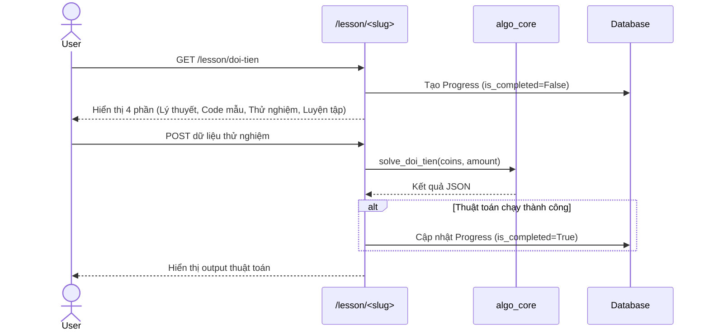

# 📋 BÁO CÁO PHÂN TÍCH DỰ ÁN WEBSITE

## **DP MASTER — Nền tảng học Thuật toán Quy Hoạch Động tương tác**

| Thông tin | Chi tiết |
|---|---|
| **Tên dự án** | DP Master |
| **Loại sản phẩm** | Web Application (Nền tảng E-Learning) |
| **Ngôn ngữ lập trình** | Python (Backend), HTML/CSS/JS (Frontend) |
| **Framework** | Flask |
| **Ngày báo cáo** | 19/05/2026 |

---

## 1. TỔNG QUAN DỰ ÁN

### 1.1. Mục tiêu
DP Master là một nền tảng học thuật toán trực tuyến, tập trung vào **Quy Hoạch Động (Dynamic Programming)** và các thuật toán duyệt đồ thị. Website cho phép người dùng:

- Học lý thuyết thuật toán qua các bài giảng có cấu trúc
- **Thử nghiệm thuật toán trực tiếp** trên trình duyệt với dữ liệu tùy chỉnh
- **Luyện tập viết code** Python trong editor tích hợp (CodeMirror)
- Theo dõi tiến độ học tập cá nhân qua Dashboard

### 1.2. Đối tượng người dùng
- Sinh viên Công nghệ Thông tin
- Người tự học thuật toán, chuẩn bị phỏng vấn lập trình

### 1.3. Danh sách bài học (9 bài)

| # | Bài học | Kỹ thuật |
|---|---|---|
| 1 | Đổi tiền (Coin Change) | Quy hoạch động |
| 2 | Dãy con tăng dài nhất (LIS) | Quy hoạch động |
| 3 | Nhân chuỗi ma trận (MCM) | Quy hoạch động |
| 4 | Đường đi ngắn nhất trên DAG | QHĐ + Topo Sort |
| 5 | Tìm kiếm theo chiều rộng (BFS) | Duyệt đồ thị |
| 6 | Tìm kiếm theo chiều sâu (DFS) | Duyệt đồ thị |
| 7 | Tính số tổ hợp C(n,k) | QHĐ (Tam giác Pascal) |
| 8 | Xâu con chung dài nhất (LCS) | Quy hoạch động |
| 9 | Bài toán Cái túi (0/1 Knapsack) | Quy hoạch động |

---

## 2. KIẾN TRÚC HỆ THỐNG

### 2.1. Sơ đồ kiến trúc



### 2.2. Cấu trúc thư mục

```
DOAN1/
├── run.py                  # Entry point, cấu hình Flask & migration
├── seed_lessons.py         # Script nạp dữ liệu bài học
├── requirements.txt        # Dependencies
├── test_render.py          # Script test render template
├── app/
│   ├── __init__.py
│   ├── models.py           # 3 models: User, Lesson, Progress
│   ├── routes.py           # Toàn bộ route logic (~387 dòng)
│   ├── algo_core/          # 9 file thuật toán Python
│   │   ├── doitien.py
│   │   ├── day_con_tang_dai_nhat.py
│   │   ├── nhanmatran.py
│   │   ├── timduongngannhat.py
│   │   ├── timkiemrong.py
│   │   ├── timkiemsau.py
│   │   ├── tinhsotohop.py
│   │   ├── xauconchungnhat.py
│   │   └── xepbalo.py
│   ├── templates/          # 9 file HTML (Jinja2)
│   │   ├── base.html
│   │   ├── index.html
│   │   ├── dashboard.html
│   │   ├── lesson.html
│   │   ├── login.html
│   │   ├── register.html
│   │   ├── settings.html
│   │   ├── setup_2fa.html
│   │   └── verify_2fa.html
│   └── static/
│       ├── style.css       # CSS cũ (style gốc)
│       ├── app.js          # Levenshtein search (client-side)
│       ├── css/style.css   # CSS chính (572 dòng, design system)
│       └── images/
└── instance/
    └── dp_master.db        # SQLite database
```

---

## 3. PHÂN TÍCH CHỨC NĂNG

### 3.1. Sơ đồ Use Case



### 3.2. Chi tiết các Module chức năng

#### 🔐 Module Xác thực (Authentication)
| Chức năng | Route | Method | Mô tả |
|---|---|---|---|
| Đăng nhập | `/login` | GET/POST | Kiểm tra user + pass, hỗ trợ 2FA flow |
| Đăng ký | `/register` | GET/POST | Tạo tài khoản mới, hash mật khẩu PBKDF2-SHA256 |
| Đăng xuất | `/logout` | GET | Xóa session |
| Xác thực OTP | `/verify-2fa` | GET/POST | Nhập mã 6 số từ app authenticator |

**Điểm nổi bật:**
- Mật khẩu được hash bằng `pbkdf2:sha256` (Werkzeug)
- Soft-delete user bị chặn đăng nhập qua `@app.before_request` middleware
- 2FA: Giới hạn 5 lần nhập sai, khóa 5 phút (brute-force protection)

#### 🛡️ Module Bảo mật 2FA (TOTP)
| Chức năng | Route | Mô tả |
|---|---|---|
| Thiết lập 2FA | `/setup-2fa` | Tạo TOTP secret, hiển thị QR Code |
| Tạo QR Code | `/qr-code` | Trả về ảnh PNG QR code |
| Tắt 2FA | `/disable-2fa` | Yêu cầu xác nhận mật khẩu |

**Công nghệ:** PyOTP (TOTP), qrcode[pil], Google Authenticator compatible

#### 📚 Module Học tập (Learning)
| Chức năng | Route | Mô tả |
|---|---|---|
| Trang chủ | `/` | Danh sách bài học (khóa khi chưa đăng nhập) |
| Chi tiết bài học | `/lesson/<slug>` | 4 phần: Lý thuyết → Code mẫu → Thử nghiệm → Luyện tập |
| Dashboard | `/dashboard` | Lộ trình học, tiến độ, thanh progress |

#### ⚙️ Module Quản lý tài khoản
| Chức năng | Route | Mô tả |
|---|---|---|
| Cài đặt | `/settings` | Trang quản lý tài khoản |
| Đổi mật khẩu | `/change-password` | Xác thực mật khẩu cũ, tối thiểu 6 ký tự |
| Xóa tài khoản | `/delete-account` | Soft delete: ẩn danh hóa username + xóa 2FA |

#### 💻 Module Chạy Code
| Chức năng | Route | Mô tả |
|---|---|---|
| Chạy code | `/run_code` | Thực thi code Python trong subprocess, timeout 5s |

---

## 4. CƠ SỞ DỮ LIỆU

### 4.1. Sơ đồ ERD



### 4.2. Thông tin kỹ thuật
- **DBMS:** SQLite (file: `instance/dp_master.db`)
- **ORM:** Flask-SQLAlchemy
- **Migration:** Thủ công qua `ALTER TABLE` trong `run.py` (không dùng Alembic)

---

## 5. CÔNG NGHỆ SỬ DỤNG

### 5.1. Backend

| Công nghệ | Phiên bản | Vai trò |
|---|---|---|
| Python | 3.x | Ngôn ngữ chính |
| Flask | Latest | Web framework |
| Flask-SQLAlchemy | Latest | ORM |
| Flask-Login | Latest | Quản lý session/auth |
| PyOTP | 2.9.0 | Tạo/xác thực mã TOTP |
| qrcode[pil] | Latest | Tạo QR code |
| Werkzeug | Bundled | Hash mật khẩu |

### 5.2. Frontend

| Công nghệ | Vai trò |
|---|---|
| HTML5 + Jinja2 | Template engine |
| CSS3 (Custom Design System) | UI styling, 572 dòng |
| Vanilla JavaScript | Client-side logic |
| CodeMirror 5.65.13 (CDN) | Code editor (theme Dracula) |
| Google Fonts (Inter) | Typography |

### 5.3. Đặc điểm thiết kế UI
- **Design System** hoàn chỉnh với CSS Variables (`--primary`, `--bg-color`, `--border`...)
- Card-based layout với shadow, border-radius 12px
- Gradient buttons, hover animations (translateY)
- User dropdown menu kiểu Microsoft Learn
- Section badges đánh số trên trang bài học
- Progress bar với 2 trạng thái: "Đang học" (xanh dương) / "Hoàn thành" (xanh lá)
- Responsive grid: `auto-fill, minmax(300px, 1fr)`

---

## 6. LUỒNG HOẠT ĐỘNG CHÍNH

### 6.1. Luồng đăng nhập (có 2FA)



### 6.2. Luồng học bài



---

## 7. ĐÁNH GIÁ DỰ ÁN

### 7.1. Điểm mạnh ✅

| # | Điểm mạnh | Chi tiết |
|---|---|---|
| 1 | **Tính tương tác cao** | Người dùng nhập dữ liệu → chạy thuật toán → xem kết quả ngay |
| 2 | **Code editor tích hợp** | CodeMirror với syntax highlighting, chạy code Python trực tiếp |
| 3 | **Bảo mật tốt** | PBKDF2 hash, TOTP 2FA, brute-force protection, soft-delete |
| 4 | **Kiến trúc rõ ràng** | Tách biệt: Models / Routes / Templates / Algorithm Core |
| 5 | **Tracking tiến độ** | Tự động ghi nhận khi user hoàn thành bài |
| 6 | **UI/UX chỉn chu** | Design system nhất quán, animations, responsive |
| 7 | **Client-side search** | Levenshtein Distance (DP) cho gợi ý tìm kiếm fuzzy |

### 7.2. Điểm cần cải thiện ⚠️

| # | Vấn đề | Mức độ | Đề xuất |
|---|---|---|---|
| 1 | **SECRET_KEY hardcode** | 🔴 Cao | Chuyển sang biến môi trường (`.env`) |
| 2 | **Chạy code trên server** | 🔴 Cao | Subprocess không sandbox → RCE risk. Cần Docker/sandbox |
| 3 | **Không có CSRF protection** | 🟡 Trung bình | Thêm Flask-WTF hoặc CSRFProtect |
| 4 | **Migration thủ công** | 🟡 Trung bình | Chuyển sang Flask-Migrate (Alembic) |
| 5 | **Duplicate CSS** | 🟡 Trung bình | Có 2 file style.css, nên gộp hoặc xóa file cũ |
| 6 | **app.js không sử dụng** | 🟢 Thấp | `window.onload → loadContent('fibonacci')` không tồn tại route `/api/lesson/` |
| 7 | **Legacy API Warning** | 🟢 Thấp | `User.query.get()` deprecated → dùng `db.session.get(User, id)` |
| 8 | **Không có unit test** | 🟡 Trung bình | Thêm pytest cho algo_core và routes |

---

## 8. THỐNG KÊ DỰ ÁN

| Metric | Giá trị |
|---|---|
| **Tổng số file code** | ~25 files |
| **Backend (Python)** | ~14 files, ~950 dòng |
| **Frontend (HTML)** | 9 templates, ~730 dòng |
| **CSS** | 2 files, ~710 dòng |
| **JavaScript** | 1 file (app.js) + inline scripts |
| **Số route** | 14 endpoints |
| **Số model CSDL** | 3 (User, Lesson, Progress) |
| **Số thuật toán** | 9 bài |
| **Dependencies** | 5 packages (requirements.txt) |

---

## 9. KẾT LUẬN

### Đánh giá tổng thể

DP Master là một dự án **hoàn chỉnh và có giá trị thực tiễn** trong lĩnh vực EdTech. Dự án thể hiện khả năng:

1. **Full-stack development**: Backend Flask + Frontend HTML/CSS/JS + Database SQLite
2. **Áp dụng thuật toán thực tế**: 9 thuật toán DP/Graph được triển khai hoàn chỉnh với input/output tương tác
3. **Bảo mật nhiều lớp**: Hash mật khẩu, 2FA TOTP, soft-delete, rate limiting OTP
4. **UX tốt**: Design system nhất quán, tiến độ học tập, code editor tích hợp

### Đề xuất ưu tiên phát triển tiếp

1. 🔴 **Bảo mật**: Di chuyển SECRET_KEY ra `.env`, thêm CSRF, sandbox code execution
2. 🟡 **Kỹ thuật**: Chuyển sang Flask-Migrate, dọn dẹp CSS/JS không sử dụng
3. 🟢 **Tính năng**: Thêm Admin panel, thống kê, export PDF chứng chỉ hoàn thành

---

> **Báo cáo được tạo bởi AI Project Analyst**
> *Dựa trên phân tích toàn bộ source code dự án DP Master*
